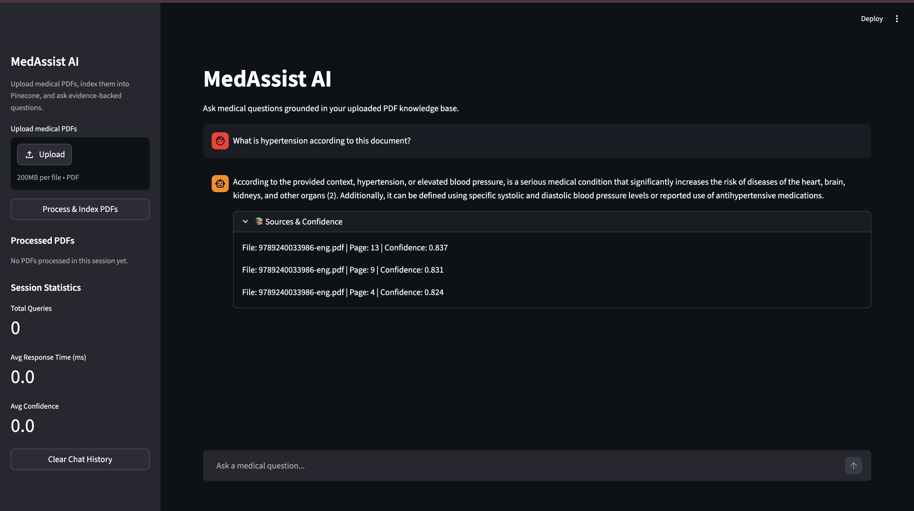

# MedAssist AI


MedAssist AI is a full-stack Retrieval Augmented Generation (RAG) medical chatbot that answers questions using content retrieved from medical PDF documents. It runs a local Ollama model for generation, uses HuggingFace embeddings for indexing, stores vectors in Pinecone, and serves a Streamlit chat interface.

## Architecture

```text
                +----------------------+
                |   Medical PDF Files  |
                +----------+-----------+
                           |
                           v
                +----------------------+
                |   PDF Text Extract   |
                +----------+-----------+
                           |
                           v
                +----------------------+
                | Recursive Chunking   |
                +----------+-----------+
                           |
                           v
                +----------------------+
                | HuggingFace Embeds   |
                +----------+-----------+
                           |
                           v
                +----------------------+
                |  Pinecone Vector DB  |
                +----------+-----------+
                           |
                           v
                +----------------------+
                | LangChain Retriever  |
                +----------+-----------+
                           |
                           v
                +----------------------+
                | Ollama Local LLM     |
                +----------+-----------+
                           |
                           v
                +----------------------+
                | Streamlit Chat UI    |
                +----------------------+
```

## Features

- Run the chatbot with a local Ollama model such as `llama3` or `mistral`
- Upload one or many medical PDFs from the Streamlit sidebar
- Batch index local PDFs with `store_index.py`
- Retrieve top-matching document chunks with confidence filtering
- Answer only from indexed medical context using a conversational RAG chain
- Display source files, page numbers, confidence scores, and response timing
- Track session analytics for usage and performance
- Run locally or through Docker while pointing at a local Ollama server

## Tech Stack

| Layer | Technology |
| --- | --- |
| Language | Python 3.10+ |
| UI | Streamlit |
| LLM | Ollama via `langchain-ollama` |
| Embeddings | HuggingFace `all-MiniLM-L6-v2` |
| Vector DB | Pinecone |
| RAG Orchestration | LangChain |
| PDF Parsing | PyPDF2 |
| Config | python-dotenv |
| Deployment | Docker, Docker Compose |

## Setup

### Local

1. Create and activate a Python 3.10+ virtual environment.
2. Install dependencies:

```bash
pip install -r requirements.txt
```

3. Install Ollama on macOS from the official guide: [Ollama macOS install](https://docs.ollama.com/macos)
4. Pull a local model:

```bash
ollama pull llama3
```

You can also use:

```bash
ollama pull mistral
```

5. Make sure Ollama is running locally:

```bash
ollama list
```

6. Copy `.env.example` to `.env` and set your Pinecone details:

```bash
cp .env.example .env
```

7. Add PDFs to `data/medical_pdfs/` or upload them in the app.
8. Run the app:

```bash
streamlit run app.py
```

9. Optional: batch index PDFs from disk:

```bash
python store_index.py
```

### Docker

1. Install Ollama on the host machine and pull the model you want to use.
2. Confirm Ollama is reachable on the host at `http://localhost:11434`.
3. Create `.env` from `.env.example`.
4. Build and run:

```bash
docker-compose up --build
```

5. Open `http://localhost:8501`.

Note: the container connects to Ollama running on the host through `host.docker.internal`.

## Usage

### Streamlit Workflow

1. Launch the app.
2. Upload one or more PDFs from the sidebar.
3. Click `Process & Index PDFs`.
4. Ask a medical question in the chat box.
5. Expand `📚 Sources & Confidence` to inspect retrieved evidence.

## Screenshots



## Project Structure

```text
MedAssist-AI/
├── src/
│   ├── __init__.py
│   ├── config.py
│   ├── pdf_processor.py
│   ├── text_splitter.py
│   ├── embedding_manager.py
│   ├── vector_store.py
│   ├── retriever.py
│   ├── chain_builder.py
│   ├── chat_engine.py
│   └── logger.py
├── data/
│   └── medical_pdfs/
├── app.py
├── store_index.py
├── requirements.txt
├── Dockerfile
├── docker-compose.yml
├── .env.example
├── .gitignore
├── setup.py
└── README.md
```

## How RAG Works

The application extracts text from medical PDFs, splits it into overlapping chunks, turns those chunks into vector embeddings, and stores them in Pinecone. When a user asks a question, the retriever finds the most relevant chunks, filters them by confidence, and passes the context into a local Ollama model to produce a grounded answer.

## Future Improvements

- Add namespaces for per-user or per-dataset isolation
- Support OCR for scanned PDFs
- Add authentication and audit logging
- Add evaluation pipelines for retrieval quality and hallucination detection
- Add citation highlighting at chunk level in the UI

## License

MIT
